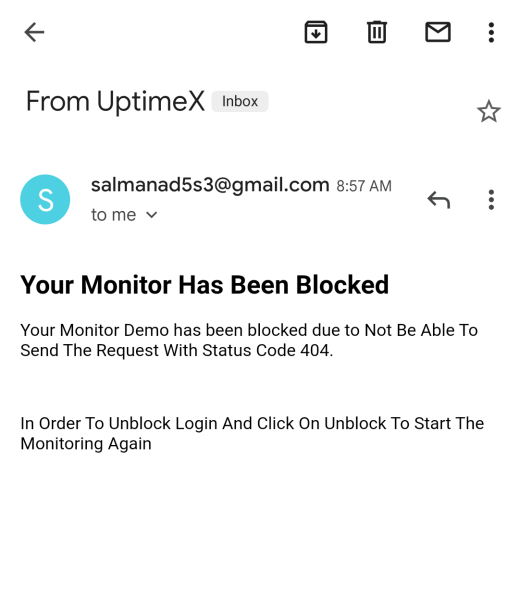

# UptimeX

 
<h1>Link : https://uptimex.herokuapp.com/  
The world's leading uptime monitoring service.Get Unlimited monitors with 5-minute checks totally FREE.</h1>
<h2>How It Works</h2>

- You Need To Provide the URL Of The Website For Which You Wanted To Monitor
- It'll Send The Request To Check If the URL That You Have Enter Is Exsist/Correct.
- If It's Exsist Then it'll Scrapp the Email From That Website
- And Will Do The Monitoring After 5 Minutes And For Email It's 30m
- If Any Of The Two Is Fail It'll Notified You By Sending the Mail And Will Block The Monitor Also
- You Just Need to Login and Click the Unblock Button For Starting Monitoring Again

<h2>Here Is The Full Tutorial For It</h2>

- Click On the Create Monitor And Add The Url And Name For Your Monitor
   
   
  
   

- Click On Save Changes To And The Monitor
- After Adding Successfully You Can See the Monitor Below
 
 

 
 
<h2>What If The Monitor Fail</h2>

Consider This Example

#### Creating Simple HTML And Deploying via Github Pages

### Now Creating The Monitor

### After Removing From The Github Pages We got The Mail

 

- You Need To Click On The Unblock Button For Starting Monitoring Again

 

- Note If Your Web Does Not Have The Email Then It'll Take notfound@gmail.com As A Default Mail

